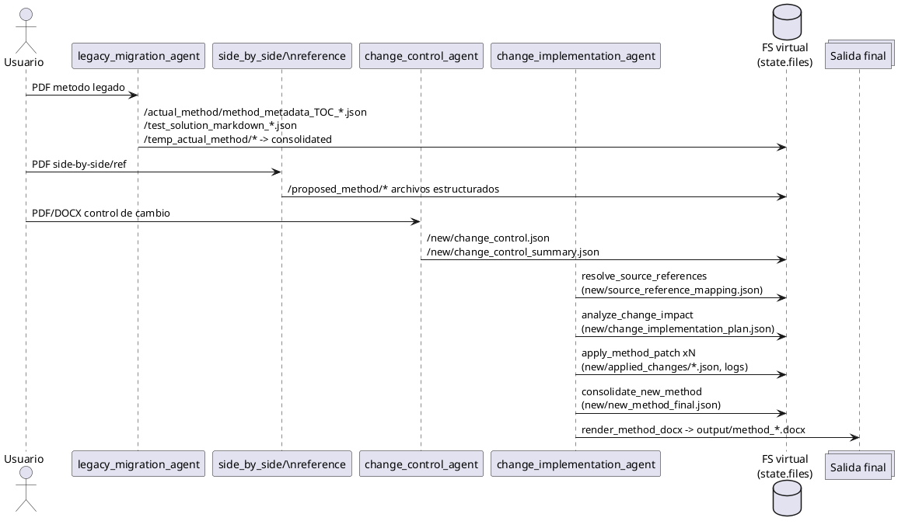
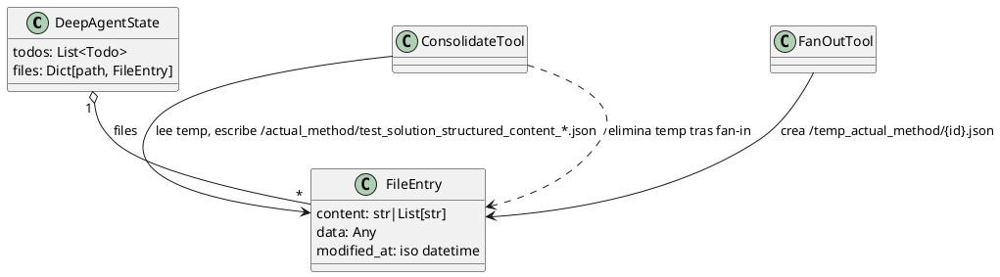

# Documentacion tecnica - MA Change Control

## Resumen
- Sistema multiagente para migrar metodos analiticos, procesar controles de cambio y consolidar un metodo final con DOCX.
- Patronea el esquema del documento de arquitectura base (tres agentes coordinados, estado virtual, fan-out/fan-in) aplicandolo al dominio de control de cambios.
- Tecnologias: LangGraph + DeepAgents, LLMs de OpenAI/Mistral, OCR, Pydantic para esquemas, docxtpl para render.
- El documento Word de referencia (371 lineas en `doc_text.txt`) enfatiza arquitecturas de tres agentes, deduplicacion y manejo de estado inmutable; esta guia refleja esos principios con rutas y herramientas concretas del repositorio.

## Arquitectura de agentes
- `src/graph/builder.py`: crea `am_change_control_agent` con modelo `openai:gpt-5-mini`.
- Subagentes (`src/agents/sub_agents_config.py`):
  - `legacy_migration_agent`: ingesta de metodo legado a `/actual_method/`.
  - `change_control_agent`: ingesta de control de cambios a `/new/change_control*.json`.
  - `side_by_side_agent`: extrae columna propuesta de PDF side-by-side a `/proposed_method/`.
  - `reference_methods_agent`: ingesta de metodos de referencia a `/proposed_method/`.
- `change_implementation_agent`: resuelve referencias, genera plan, aplica parches y renderiza DOCX final.
- Estado: `DeepAgentState` extiende `AgentState` con `todos` y sistema de archivos virtual `files` con reducer (`src/graph/state.py`).

## Estructura de archivos clave
- Configuracion: `langgraph.json` (python 3.11, graph `am_change_control`), `.env` esperado para llaves.
- Directorios virtuales (en `state.files`):
  - `/actual_method/`: metadata y contenido estructurado del metodo legado.
  - `/proposed_method/`: metadata y contenido de metodos propuestos (side-by-side o referencia).
  - `/temp_actual_method/` y `/temp_proposed_method/`: resultados paralelos de `test_solution_structured_extraction`.
  - `/analytical_tests/`: resumen de pruebas por archivo (fuente, tipo, section_id).
  - `/new/`: plan, parches, metodo consolidado, mapeo de referencias, resumen de CC, info de DOCX.
  - `/logs/`: bitacora de parches aplicados.
- Plantillas y salida: `src/template/Plantilla_ESP.docx` y `src/template/Plantilla_EN.docx` (selección automática según idioma, override con `template_path`), `output/` (DOCX generado).
- Dependencias: ver `requirements.txt` (langchain/langgraph/deepagents, mistralai para OCR, docxtpl/python-docx para render, pypdf2/pypdf, numpy/pandas).

## Flujos principales
- Migracion de metodo legado (base `/actual_method/`):
  1) `pdf_da_metadata_toc` (OCR + document_annotation) genera `method_metadata_TOC_{name}.json` con markdown completo y TOC.
  2) `test_solution_clean_markdown` detecta pruebas/soluciones en markdown, guarda `test_solution_markdown_{name}.json`.
  3) Fan-out: `test_solution_structured_extraction` por `id` produce `/temp_actual_method/{name}/{id}.json` (modelo `TestSolutions`).
  4) Fan-in: `consolidate_test_solution_structured` fusiona en `test_solution_structured_content_{name}.json` y registra pruebas en `/analytical_tests/{name}.json`.
- Side-by-side (base `/proposed_method/`):
  - `sbs_proposed_column_to_pdf_md` recorta la columna propuesta, ejecuta OCR y guarda `method_metadata_TOC_{name}.json`.
  - `test_solution_clean_markdown_sbs` -> fan-out `test_solution_structured_extraction` (base `/proposed_method`) -> fan-in `consolidate_test_solution_structured`.
- Metodos de referencia (base `/proposed_method/`):
  - Reusa `pdf_da_metadata_toc` -> `test_solution_clean_markdown` -> `test_solution_structured_extraction` -> `consolidate_test_solution_structured`.
- Control de cambios:
  - `extract_annex_cc` procesa PDF/DOCX (OCR + LLM) y escribe `/new/change_control.json` y `/new/change_control_summary.json`.
- Implementacion de cambios:
  1) `resolve_source_references` mapea codigos de producto/metodo a `source_file_name` usando metadatos de `/actual_method/` y `/proposed_method/`; actualiza `/new/change_control_summary.json` y guarda `/new/source_reference_mapping.json`.
  2) `analyze_change_impact` carga todos los `test_solution_structured_content_*.json` y el CC; genera plan `/new/change_implementation_plan.json` (acciones editar/adicionar/eliminar/dejar igual).
  3) Fan-out: `apply_method_patch` por `action_index` (usa plan, metodos legado/propuesto, LLM) guarda parches `/new/applied_changes/{i}.json` y bitacora `/logs/change_patch_log.jsonl`.
  4) Fan-in: `consolidate_new_method` aplica parches sobre metodo base, copia metadata del legado y deja `/new/new_method_final.json`.
  5) `render_method_docx` detecta idioma (es/en), usa `src/template/Plantilla_ESP.docx` o `src/template/Plantilla_EN.docx` (o plantilla dada en `template_path`), genera DOCX en `output/` y registra `/new/rendered_docx_info.json`.

## Herramientas (src/tools) a detalle
- Ingesta/OCR:
  - `pdf_da_metadata_toc(dir_method, base_path="/actual_method")`: valida PDF, chunking, OCR Mistral, merge de annotations, markdown completo, TOC + `toc_validation_metrics`, escribe `method_metadata_TOC_{source}.json` con `source_file_name`.
  - `sbs_proposed_column_to_pdf_md(dir_document)`: corta columna derecha con OpenCV/PyMuPDF, OCR Mistral, marca paginas de baja confianza; escribe en `/proposed_method/` el markdown y `source_file_name`.
- Limpieza de markdown y deteccion de pruebas:
  - `test_solution_clean_markdown`: elimina TOC, aisla PROCEDIMIENTOS/DESARROLLO, chunking `gpt-5-mini`, dedup de subapartados profundos, construye segmentos markdown por prueba; salida `test_solution_markdown_{source}.json`.
  - `test_solution_clean_markdown_sbs`: igual sin recorte de TOC (columna ya filtrada), base `/proposed_method/`.
- Extraccion estructurada:
  - `test_solution_structured_extraction(id, source_file_name, base_path)`: LLM estructurado `TestSolutions`, preserva `_source_id` y `source_file_name`, guarda `/temp_{actual|proposed}/{source}/{id}.json`.
  - `consolidate_test_solution_structured`: fan-in de temporales, ordena por `source_id`, genera `test_solution_structured_content_{source}.json` y `/analytical_tests/{source}.json`, limpia temporales.
- Control de cambios:
  - `extract_annex_cc(dir_document, document_type)`: convierte DOCX a PDF si es necesario, OCR + schema pydantic (`ChangeControlModel`/otros), guarda payload completo (`/new/change_control.json`) y resumen (`/new/change_control_summary.json`) con `cambios_pruebas_analiticas` y `pruebas_nuevas`.
- Resolucion y planeacion:
  - `resolve_source_references`: construye mapeo `codigo_producto|numero_metodo -> source_file_name` desde metadatos; actualiza `change_control_summary` con `resolved_source_file_name` y guarda reporte `/new/source_reference_mapping.json`.
  - `analyze_change_impact`: carga todos los `test_solution_structured_content_*.json` (legacy/proposed) y CC; arma contexto, genera plan `/new/change_implementation_plan.json` con conteo por accion; valida cobertura y emite advertencias.
- Aplicacion y consolidacion final:
  - `apply_method_patch(action_index)`: valida plan, reconstruye metodo base si falta, localiza prueba objetivo por `_source_id`/section/nombre, toma evidencia propuesta/legacy, invoca LLM (`GeneratedMethodPatch`), guarda parche `/new/applied_changes/{i}.json`, actualiza metodo acumulado y log `/logs/change_patch_log.jsonl`.
  - `consolidate_new_method`: aplica parches en orden, conserva metadata del legado (apis, tipo_metodo, objetivo, historico, etc.), escribe `/new/new_method_final.json`, limpia parches consumidos.
  - `render_method_docx`: normaliza texto (elimina caracteres de control, convierte LaTeX simple), detecta idioma y elige `Plantilla_ESP.docx` o `Plantilla_EN.docx` (override con `template_path`), deja DOCX en `output/` y metadata (con `detected_language`) en `/new/rendered_docx_info.json`.

## Estado virtual y archivos
- Cada entrada en `files` sigue `{ "content": [...]|str, "data": obj, "modified_at": iso }`.
- Rutas clave: `/actual_method/`, `/proposed_method/`, `/temp_actual_method/`, `/temp_proposed_method/`, `/analytical_tests/`, `/new/`, `/logs/`.
- Reducer `file_reducer` permite merges incrementales; las consolidaciones limpian fan-out (ej. borra `/temp_*` consumidos).
- `todos` opcional para seguimiento de pasos (usado por supervisor).

## Modelos de datos (src/models)
- `MetodoAnaliticoDA` y `MetodoAnaliticoCompleto`: metadata + markdown completo + tabla de contenidos literal, mas campos de alcance, equipos, anexos, historico de cambios.
- `TestSolution` y `TestSolutions` (`structured_test_model.py`): captura verbatim de soluciones, procedimientos (SST dentro del procedimiento), calculos (formula + variables), criterios, tablas de parametros; incluye `_source_id`, `section_id`, `test_type` tipados.
- `ControlCambioOutput` y `ChangeControlModel` (`change_control.py`): resumen y payload estructurado de CC con `cambios_pruebas_analiticas`, `pruebas_nuevas`, productos afectados, actividades de evaluacion/implementacion/post-cambio, prerrequisitos y notas.
- `MetodoAnaliticoFinal`/`MetodoAnaliticoNuevo`: metodos consolidados con metadata de portada y lista de pruebas (formato `TestSolution`).

## Configuracion y prerequisitos
- Python 3.11 (`langgraph.json`), deps en `requirements.txt`.
- Variables de entorno: `MISTRAL_API_KEY` requerida para OCR (Mistral); OpenAI se configura via `init_chat_model`.
- Plantillas DOCX en `src/template/Plantilla_ESP.docx` (es) y `Plantilla_EN.docx` (en); salida en `output/`.
- Para procesamiento correcto, los archivos PDF/DOCX deben estar accesibles con rutas absolutas pasadas a las herramientas.

## Decisiones y patrones (alineado al documento Word)
- Fan-out/Fan-in: extraccion de pruebas en paralelo y consolidacion unica; limpieza de temporales para mantener estado compacto.
- Estado inmutable: herramientas devuelven `Command(update={files,...})`; el reducer `file_reducer` sobreescribe con la version mas reciente.
- Trazabilidad: `_source_id` y `source_file_name` viajan en cada etapa, permitiendo matching en plan y parches.
- Normalizacion y matching flexible: `resolve_source_references` limpia prefijos y guiones para codigos de producto/metodo; `analyze_change_impact` valida cobertura (pruebas legadas vs nuevas) y reporta advertencias.
- Paralelismo: chunking y deteccion de headers usan `asyncio`; OCR de paginas usa `ThreadPoolExecutor`; el supervisor puede lanzar agentes de ingesta en paralelo.
- Limpieza: `consolidate_test_solution_structured` borra `/temp_*`; `consolidate_new_method` descarta parches consumidos y fusiona metadata legado + pruebas finales.

## Operacion sugerida (manual)
1) Preparar llaves: definir `MISTRAL_API_KEY` y credenciales OpenAI en `.env` o entorno.
2) Ingesta:
   - Metodo legado: `legacy_migration_agent` con ruta PDF.
   - Side-by-side o referencia: `side_by_side_agent` / `reference_methods_agent` con PDF.
   - Control de cambios: `change_control_agent` con PDF/DOCX.
3) Implementacion:
   - Ejecutar `change_implementation_agent` cuando existan `/actual_method/test_solution_structured_content_*.json`, `/proposed_method/test_solution_structured_content_*.json` (si aplica) y `/new/change_control_summary.json`.
   - Flujo interno: `resolve_source_references` -> `analyze_change_impact` -> `apply_method_patch` para todos los indices -> `consolidate_new_method` -> `render_method_docx`.
4) Verificar salidas: `/new/source_reference_mapping.json`, `/new/change_implementation_plan.json`, `/new/applied_changes/`, `/new/new_method_final.json`, `output/method_*.docx`.

## Manejo de errores y checks rapidos
- Falta de markdown o archivos base: herramientas responden con `ToolMessage` sin escribir archivos (ej. `test_solution_clean_markdown*` si no hay markdown en metadata).
- Referencias no resueltas: `resolve_source_references` lista `resolved` y `unresolved` y actualiza `change_control_summary`; si falta CC, devuelve error explicito.
- Plan invalido o incompleto: `analyze_change_impact` valida estructura y cobertura y advierte; no escribe plan si falta input.
- Parches: `apply_method_patch` reintenta LLM (tenacity) y valida `TestSolution`; si falla, devuelve mensaje y no escribe parche.
- Render: `render_method_docx` falla si falta plantilla o metodo final; mensaje incluye ruta esperada.

## Diagramas UML (PlantUML)

### Arquitectura de agentes

```plantuml
@startuml
skinparam shadowing false
package "Supervisor (am_change_control_agent)" {
  [legacy_migration_agent]
  [change_control_agent]
  [side_by_side_agent]
  [reference_methods_agent]
  [change_implementation_agent]
}

[legacy_migration_agent] --> "pdf_da_metadata_toc\\ntest_solution_clean_markdown\\ntest_solution_structured_extraction\\nconsolidate_test_solution_structured" : usa
[side_by_side_agent] --> "sbs_proposed_column_to_pdf_md\\ntest_solution_clean_markdown_sbs\\ntest_solution_structured_extraction\\nconsolidate_test_solution_structured" : usa
[reference_methods_agent] --> "pdf_da_metadata_toc\\ntest_solution_clean_markdown\\ntest_solution_structured_extraction\\nconsolidate_test_solution_structured" : usa
[change_control_agent] --> "extract_annex_cc" : usa
[change_implementation_agent] --> "resolve_source_references\\nanalyze_change_impact\\napply_method_patch\\nconsolidate_new_method\\nrender_method_docx" : usa
@enduml
```

Explicacion: el supervisor delega en cinco subagentes, cada uno con su set de herramientas; el supervisor solo orquesta.

### Flujo de datos extremo a extremo

Explicacion: los agentes de ingesta escriben en el filesystem virtual; el agente de implementacion resuelve referencias, genera plan, aplica parches y produce el DOCX final en output/.

### Modelo de archivos virtuales y limpieza

Explicacion: el estado DeepAgentState.files guarda archivos con contenido y timestamps; las herramientas de fan-out crean temporales y las de fan-in consolidan y borran esos temporales.

